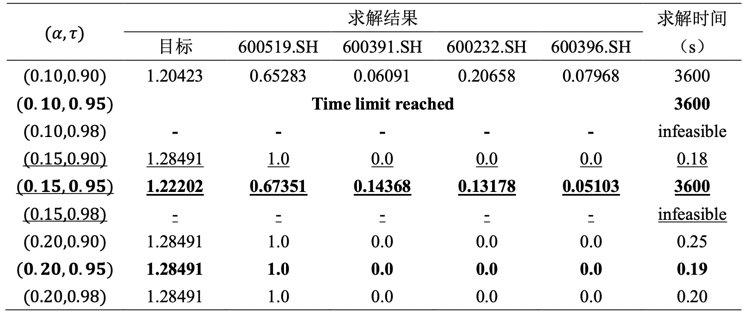

# portfolio-problem-ccp-share
# 分布式鲁棒优化实践——Portfolio问题建模与实现
## 1 问题介绍
投资组合是指我们拥有一定可供投资的资金和投资选项（基金、股票等），投资选项有着不同的收益率和风险，收益越高往往对应着风险越高。我们需要根据一定的历史数据决定我们在不同投资选项上的投资份额，以期获得最大收益。 

本文将介绍投资组合问题的分布式鲁棒优化模型及其混合整数规划模型（MIP）（2.1，2.2），使用Python通过 Tushare 获取投资选项收益数据同时使用Python 建立数学规划模型并调用求解器Gurobi 进行求解验证模型的正确性，最后对结果进行简要的分析（3.1，3.2，3.3）。

## 2 数学模型
### 2.1分布式鲁棒优化模型
（1）参数

n个可投资的投资选项（1,2,…n），年度收益为随机变量：R_1,R_2,…R_n，我们拥有一定数量的资本，在建模过程中设为“1”（资本分配比例）。

（2）CCP

原问题：在损失不超过α的概率大于等于τ的情况下，最大化期望收益

目标：

约束条件：

### 2.2构建MIP模型
转化基础：使用一定已知年份（N年）的收益估计原问题中的收益（R）。

设已知：R_i^j为投资项目i在j年时的收益。设一个投资组合序列为R_1^(m_1 ),R_2^(m_2 ),…R_n^(m_n ) (R^k,m_i=1,…N)，则投资组合序列数为：K=N^n。

**CCP**

目标：

引入辅助变量：

约束条件：

## 3 实验
### 3.1数据获取
本文使用Python通过Tushare获取股票自2012年4月1日到2022年5月1日的每日涨跌信息（如表1示例，全部结果见附件），然后以4月的第一个交易日进行统计年度增长率（表2）。

表 1股票每日涨跌信息（600000.SH）

表 2年度增长率

注：为了方便模型中的计算，此处模型增长率公式为：

### 3.2模型实现及求解结果

本模型使用Python建模调用求解器Gurobi进行求解，其中求解器初始化参数为：求解时间上限：3600s，MIPGAP：0。同时因为MIP模型复杂度随着投资选项的数量和使用的历史数据的数量呈现出指数级增长，本文仅使用三只和四只股票数据对原问题的MIP模型进行测试和分析。

（1）三只股票（'600519.SH', '600391.SH', '600232.SH'）

表 3三只股票求解结果

（2）四只股票（'600519.SH', '600391.SH', '600232.SH', '600396.SH'）

由于四只股票的复杂度较高，实验过程中并没有求解的最优解，只能输出到达求解时间的解。

表 4四只股票求解结果

### 3.3结果分析
从实验的结果中可以看出，随着α的减小（加粗行），目标值逐渐减少，直至无可行解；随着τ的增加（下划线行），目标值也逐渐减少，直至无可行解。

